# R Byte

R-byte is an open-source project management system designed to help small teams organize tasks, manage sprints, and collaborate in real time. 

The project focuses on building a responsive, real-time user experience using Laravel Livewire while maintaining a clean and scalable backend architecture.

## Table of Contents
1. [Features](#features)
2. [My Contribution](#my-contribution)
3. [Key Learnings](#key-learnings)
4. [Demo Video](#demo-video)
5. [Screenshots](#screenshots)
6. [Tech Stack](#tech-stack)
7. [System Architecture](#system-architecture)
8. [Installation](#installation)
9. [Usage](#usage)
10. [Contributing](#contributing)
11. [Future Improvements](#future-improvements)
12. [License](#license)


## Features
- **Task Management**: Create, update, and track tasks with deadlines.
- **Sprints**: Group tasks into sprints for agile project management.
- **User Roles & Permissions**: Assign tasks to teammates, control who can create, update, or delete tasks.
- **Dark/Light Mode**: Auto-detect user's system theme or toggle manually.
- **Real-Time Collaboration**: Powered by Laravel Livewire for real-time updates without page reloads.
- **Error Log**: Keep track of bugs and errors.

## My Contribution
- Designed and implemented the full-stack architecture
- Built task and sprint management modules
- Implemented role-based access control (RBAC)
- Integrated real-time updates using Laravel Livewire
- Designed responsive UI with TailwindCSS

## Key Learnings
- Improved understanding of MVC architecture in Laravel
- Learned how to manage real-time UI updates without heavy frontend frameworks
- Gained experience in designing relational database schemas
- Explored role-based permission systems

## Demo Video
[Click here to watch demo video](https://youtu.be/9Pkz8Yfd7zU)

## Screenshots

### Login
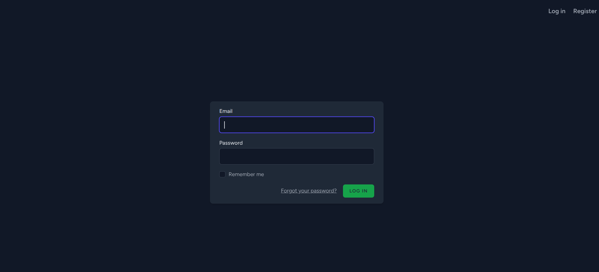

### Register
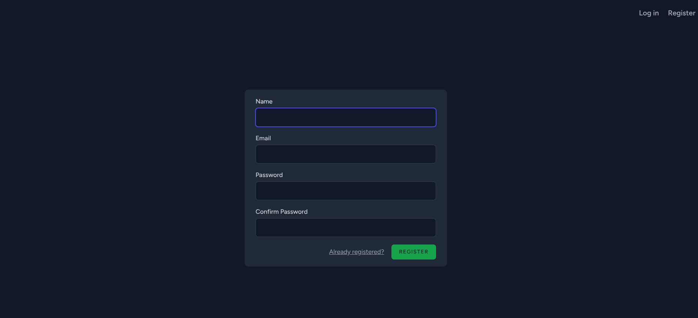

### User Profile
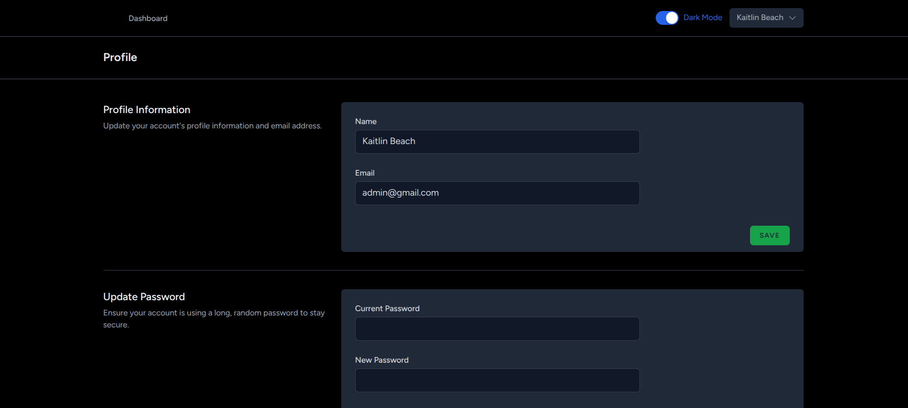
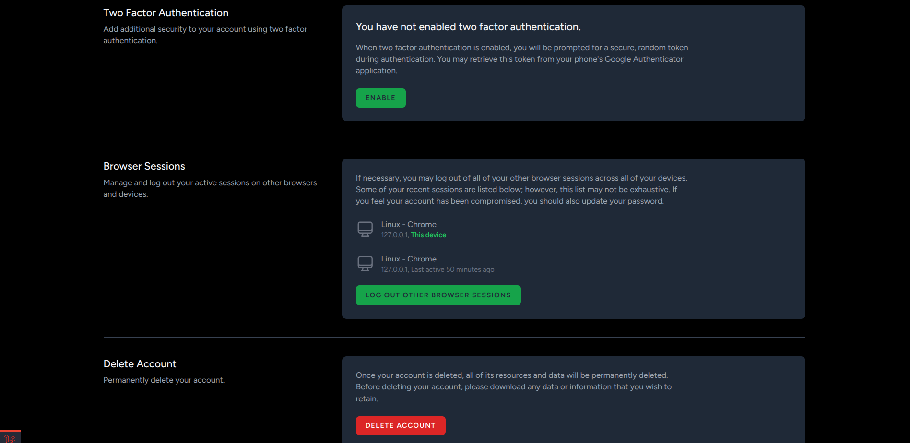

### Dashboard
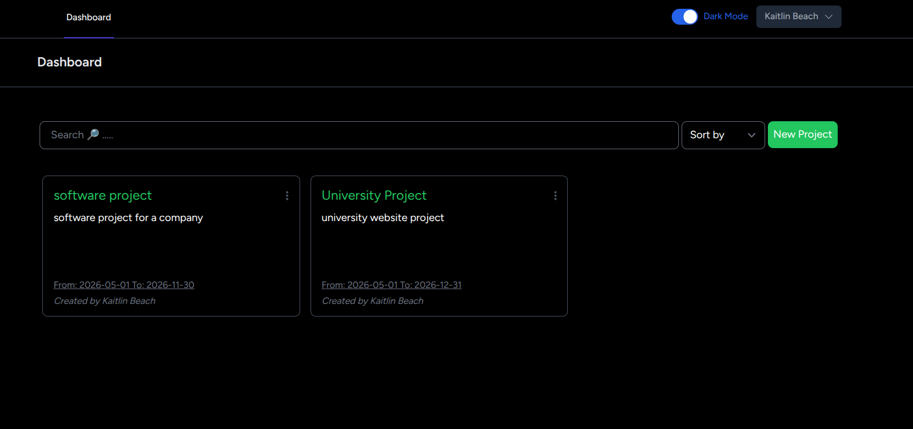

### Project >> Teams
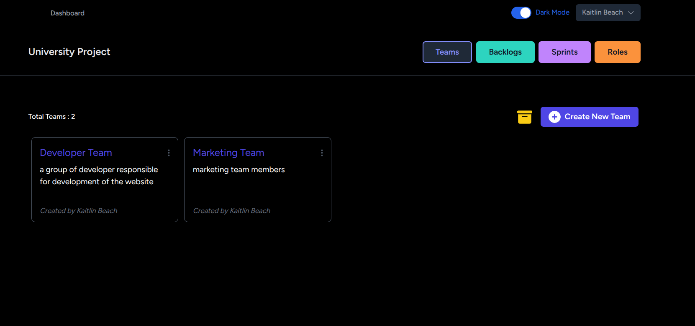

### Project >> Teams >> Members
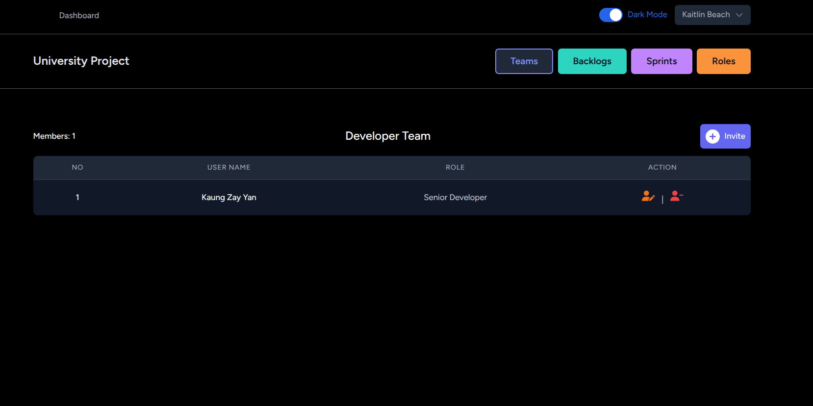

### Project >> User Roles
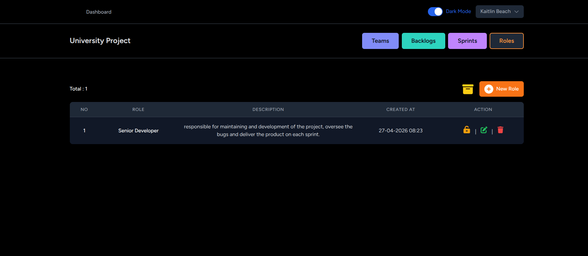

### Project >> Role Permissions
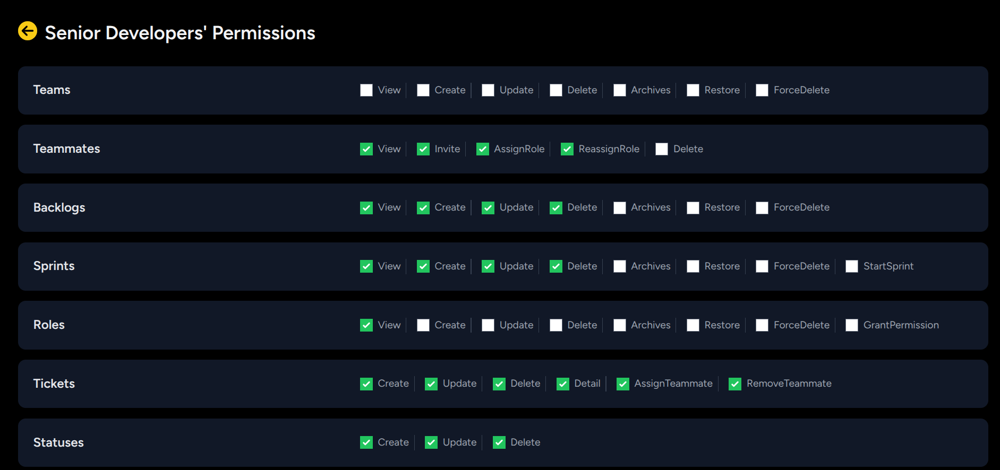

### Project >> Backlogs
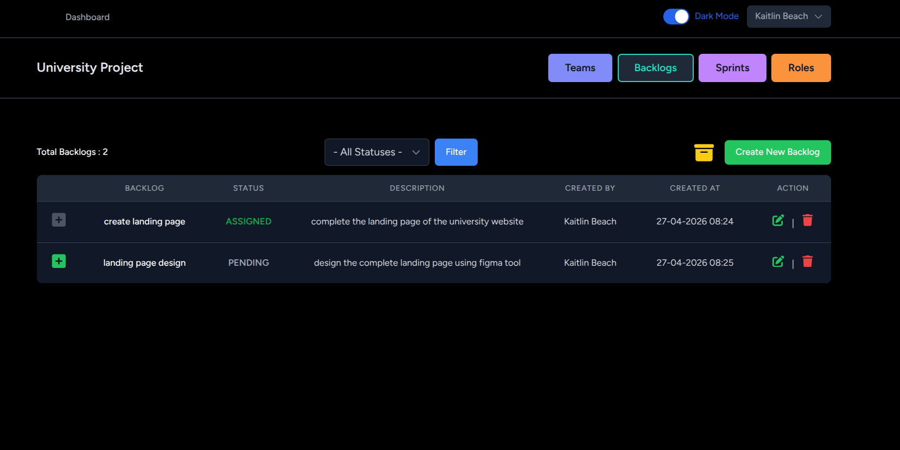

### Project >> Sprints
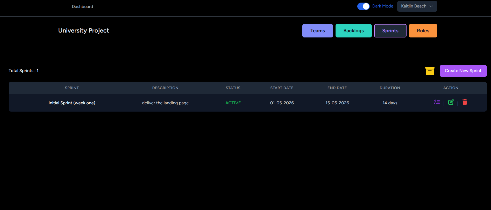

### Project >> Sprints >> tickets
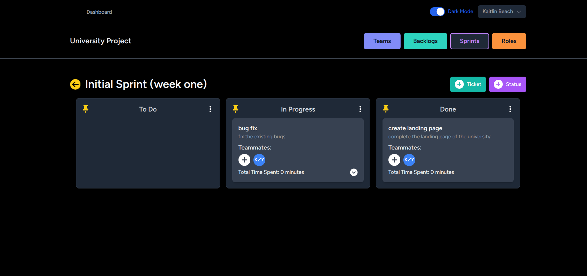

##  Tech Stack

- **Frontend**: Tailwindcss, Alpine.Js, Livewire
- **Backend**: Laravel 10
- **UI**: Jetstream

## System Architecture
The application follows the MVC pattern using Laravel:
- Models handle database interactions
- Views are managed via Blade templates and Livewire components
- Controllers manage business logic

Real-time interactions are handled using Livewire, reducing the need for separate frontend APIs.

### Entity Relationship Diagram

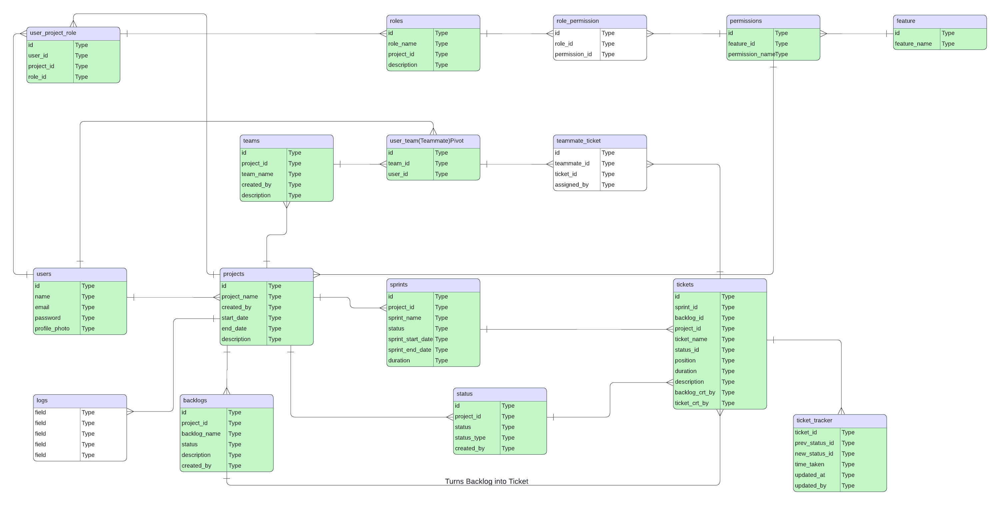
- [Entity Relationship Diagram Link](https://lucid.app/lucidchart/5288231c-4337-41ea-bfaa-e145e9d2b27b/edit?invitationId=inv_ca02fa1a-ffe1-4e04-9234-290f79935775&page=HWEp-vi-RSFO#)

## Installation

### Prerequisites

- PHP >= 8.1
- Composer
- Node.js (with npm)
- MySQL or any other database supported by Laravel
- Docker (optional)

```bash
git clone git@github.com:KaungZayY/r-byte.git
cd r-byte
composer install
npm install
cp .env.example .env
php artisan key:generate
php artisan migrate
npm run dev
php artisan serve
```

## Usage
After installation and setup:
1. **Register/Login**: You can register as a new user or login using the existing credentials.
2. **Create a Project**: Start by creating a new project. Add a name and description.
3. **Manage Tasks**: Within a project, create tasks with deadlines and assign them to team members.
4. **Sprints**: Group tasks into sprints to follow agile methodology.
5. **Role Management**: Assign team members different roles (admin, user, viewer) to control their access and permissions.
6. **Theme Management**: Toggle between light and dark themes manually, or let it auto-detect based on system preferences.

## Contributing

Contributions are welcome! If you would like to contribute to R Byte, please follow these steps:

#### 1. Fork the Git Repository

#### 2. Create a new branch: 
```bash
git checkout -b main
```

#### 3. Commit your changes: 
```bash
git commit -m 'Some features'
```

#### 4. Push to the branch: 
```bash
git push origin main.
```

#### 5. Submit a pull request.

## Future Improvements

- Add REST API for third-party integrations
- Implement notification system (email/in-app)
- Improve scalability for larger teams
- Add analytics dashboard for project insights

## License
R Byte is open-source software licensed under the MIT License.